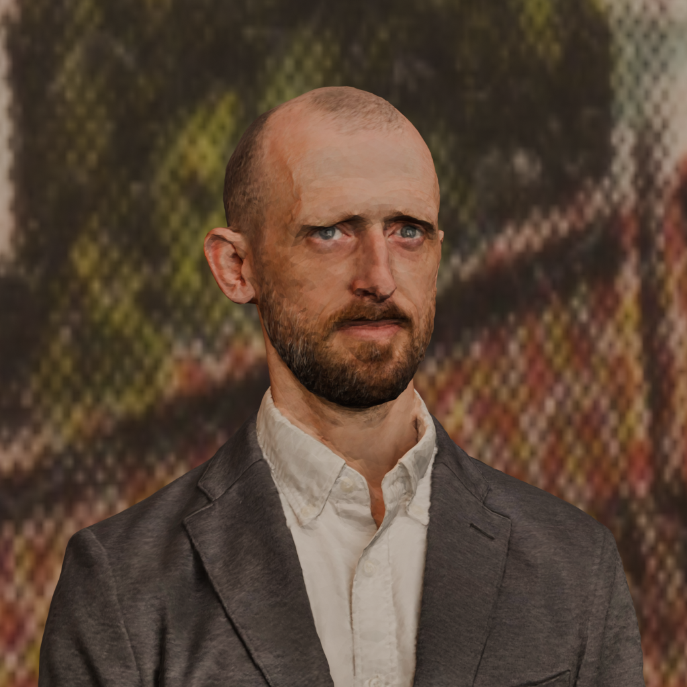

# Bios

## Pippin Barr

### Image

### ~50 word bio

Pippin Barr is an experimental game designer and Associate Professor of Computation Arts at Concordia University. His work addresses everything from contemporary art to the nature of videogames and videogame technologies. Pippin cohosts the podcast GAMETHING and his latest book on game design is *The Stuff Games Are Made Of*.

### ~100 word bio

Pippin Barr is an experimental game designer and Associate Professor of Computation Arts at Concordia University. He holds a PhD in Computer Science from Victoria University of Wellington/Te Herenga Waka and is a prolific maker of videogames, producing work addressing everything from airplane safety instructions to the nature of videogames and videogame technologies. He is a well-known figure in the independent and artistic videogame scenes and makes his games, source code and process documentation publicly available via his website pippinbarr.com. Pippin cohosts the podcast GAMETHING and his latest book, *The Stuff Games Are Made Of*, discusses videogame design in terms of its materials.

## ?

## Csongor Baranyai

[csongorb.com](http://csongorb.com/)

Game and narrative designer Csongor Baranyai has more than 15 years of history in games and interactive media. He studied film dramaturgy and scriptwriting, but worked after as a contracted game designer for several years. Since 2008, he has worked on various projects as a freelance game designer, narrative designer, and consultant for game developers, transmedia projects, and artists, as well as personal projects.  
Since 2009, he has lectured on game and system design, interactive narration, and transmedia. He has been a professor of game design at the University of Europe for Applied Sciences (UE) since 2015 and the head of the BA Game Design program there since 2016.  
He has invented, developed, and organized several events and event series dealing with games, narrative design, and digital media... such as Devolution.
