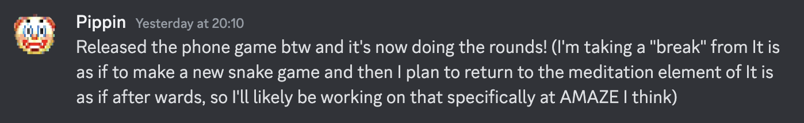

# Pippin & Devolution 2025

## 2025-01-08 Csongor

Hey Pippin,  
I guess we need to [start it somewhere,  
so le's start it](https://www.youtube.com/watch?v=lkpLbEM06qE) here.

Voice would also have been an option, [GAMETHING](https://gamething.life/)-like, but sorry, this somehow feels more natural to me. Also maybe I'm not confident enough with my spoken English, maybe even my voice. Whatever, we can aim for either/or/both in the long run, let's see where this all gets us. 

I'm incredibly happy to have the opportunity to explore and exhibit the development process of one (?) of your games, as you also explore and exhibit the development process of (your) games. In this sense, your work has always been important for Devolution (sorry I got used the use this term for everything related to understanding the development process, but I mean it in a very broad sense), has been crucial in helping us along the way with ideas and inspiration. [Games as Research](https://www.gamesasresearch.com/), [The Stuff Games Are Made Of](https://mitpress.mit.edu/9780262546119/the-stuff-games-are-made-of/), obviously.

I'm a bit afraid of too much meta-ness, thinking about thinking, exploring explorations, exhibiting exhibitions... but I think we can manage, I just felt I had to mention it once. 

Sorry to start so early with some organisational questions, but we only have 4 months for all this.

Should we focus on the exhibition/ exploration of one of your already finished (whatever that means) games? Which one (well known, last, well preserved/ documented?)?  
Do you maybe have something that is not already on [GitHub](https://github.com/pippinbarr?tab=repositories)?  
Or do we want to showcase one of your ongoing research/ development processes? Are you currently working on something that could be included here? Will you still be working on it during [A MAZE. / Berlin 2025](https://2025.amaze-berlin.de/)? Show how you work, think, search directly in the exhibition, live.  
Or any other ideas?

Looking forward to all this!
Looking forward to whatever you think!

## 2025-01-08 Pippin

Saw the invitation to this repo in the morning and immediately though *what a good idea*. I love it. Text is more my thing than anything as well - maybe I'm suspicious of my voice too... almost seems like a glamorous paranoia.

Just about to have to make lunch and then devote some time to projects so this is the right moment to quickly get back to you I think.

In short, I think any of the paths you mention can work, but I definitely have this ongoing desire to have it be an *in progress* project in the sense that it might be possible that I could still be working on it when A MAZE rolls around (though frankly ideally not). But even just having worked on a project *with this exhibition in mind* is funny and meta.

So yeah, I just started a project I'm calling *It is as if you were on your phone* which is another installment of my series of speculative future applications along with *It is as if you were playing chess*, *It is as if you were doing work*, and *It is as if you were making love*. This one kind of returns to the chess idea but in a much more generalized sense: it's a simulator of being on your phone. Swiping, tapping, frowing, smirking, mostly being deadfaced. I have this idea (in the docs) that it's this repeated turnaround... the app exists as a kind of cover when you're in public: you look like a nice normal person on their phone. But it's actually a meditative aid, because you're *not* on your phone, you just performing the (soothing?) ritualistic gestures. But actually you *are* on your phone in the end, because... you're on your phone.

I won't go into depth because that's what the game's repo is for, but it might be a fun one. There's a chance it'll be an extended project, too, because I want to make its fraternal twin *It is as if you were on your computer* to go along with it, with the same framework but different base interactions and presumed context. Kind of an "anti boss hotkey" in way?

Anyway it would be my institive preference, but it's subject to a couple of concerns:

- What if I burn out or bore out and don't finish?
- What if it's not very good? (I mean, I'm going to try but who can say this early on)
- What if it's really frustrating for you and us to work on exhibiting something that's perpetually in some kind of flux in realtime?

What do you reckon? I finished *Let's Snake: Ancient Greek Punishment* recently, which is quite well documented, self-contained, fairly amusing...?

## 2025-01-09 Csongor

What a start, thanks for the faaaaaast answer!  
But also: noooooooo! I need to run to a conference, more time please.  
I have so many things I would like to say.

## 2025-01-10 Csongor: Sorting thoughts

Trying to incorporate answering into my routine, it is not really working...

I have always felt that for Devolution, working with *finished* (and already proven *successful*) processes is cheating. Are games ever finished? Are open processes always successful? I would love to see the "flux in realtime"! I want to see the dying branches! 

But I also don't want to pressure you. Do whatever you want, Devolution should not affect the development of your game (at least not in this sense).  
Or is it already? I have some starting *uncertainty principle/ observer effect* vibes.

What if we exhibit/ explore an ongoing process?

What if we focus not on the development of *It is as if you were on your phone* alone, but on the *It is as if...* series as a whole? This would take some of the pressure off you, ease your stress about having to *deliver*... and we could already start some initial preparations on our end (more in-depth research, initial ideas to structur the process).

I have tried to get a first overview of *It is as if...* as if it were one thing, and have already seen a lot of interesting things happening (improvements/ variations in the journaling, more and less living branches, development of the *Games as Research* ideas in parallel, shifting focus):

- [*It is as if you were playing chess*](https://github.com/pippinbarr/it-is-as-if-you-were-playing-chess) (2016)
- [*It is as if you were doing work*](https://github.com/pippinbarr/itisasifyouweredoingwork) (2017)
- [*It is as if you were making love*](https://github.com/pippinbarr/itisasifyouweremakinglove) (2018)
- [*It is as if you were doing paperwork*](https://github.com/pippinbarr/it-is-as-if-you-were-doing-paperwork) (2022)
- [*It is as if you were playing a text adventure*](https://github.com/pippinbarr/it-is-as-if-you-were-playing-a-text-adventure) (2024-)
- [*It is as if you were on your phone*](https://github.com/pippinbarr/it-is-as-if-you-were-on-your-phone) (the plan)
- *It is as if you were on your computer* (the distant plan)

Do you see this all as being one?  
Is it too much for a small exhibition?

And we can also just postpone the final decision to a few weeks later... but in that case we need a backup plan. [*Let's Snake: Ancient Greek Punishment*](https://github.com/pippinbarr/lets-snake-ancient-greek-punishment) sounds great. I feel [*v r 5*](https://github.com/pippinbarr/v-r-5) or [*v r $4.99*](https://github.com/pippinbarr/v-r-4-99) could also work well, especially in an exhibition. That would add another meta layer, but less allow for the idea of live work.

> For the player... well I continue to like the idea that the game itself (and this series and many of my things) are a kind of vehicle for research by the player at a more controlled level. You play this game and you are, yourself, investigating the nature of shadows in Unity, encouraged to think about and focus on them.

[Process Journal v r 5, 21 March 2024](https://github.com/pippinbarr/v-r-5/blob/main/process/journal.md)

## 2025-01-10 Pippin

No rush no rush! Did a tiny bit of prototyping on the phone game yesterday so it's creeping along. Have started puzzling about it having many different forms and specializations, a whole app ecosystem of different apps for pretending you're doing different things. Rilla (my wife) asked when I was going to make *It is as if you were being a person* which... well in a way the phone game it that, but it did get me thinking about a podcast/album of tracks that offer you in-ear instructions on how to be a person in different contexts. Could make one for A MAZE.

## 2025-01-10 Csongor: Parallel thinking

This all sounds like a potential awesome match. I feel more and more *It is as if...* it is.  
It is as if we would exhibit/ examine an ongoing process.

## 2025-01-13 Pippin: Great minds

Huh, yes I think the idea of a kind of more general *Is is as if* thing could work really well? Gives us plenty of material to work from with the earlier games (including paperwork! ha!). And then also does happen to be the thing I'm devoting my cycles to right now in terms of *It is as if you were on your phone* (did more today), but branching out both into the idea of an "app ecosystem" suite of *It is as if*s for social camouflage (or meditation?? A point of tension for me right now; maybe that should be a "mode"?); and into the idea of *It is as if you were being a person* as a funny "end game" of all this.

So yeah this has legs? "Worst" case we can bomb out into previous work like *Work* and *Love* and *Chess* which have plenty of documentation already alongside the "failed" version of the one I'm doing know. And I can sit in the exhibition space sobbing about my failed project!

Best case it'll be even more complicated!?

## 2025-01-20 Csongor: Serial

(I have to stop talking about this all the time, but) how does time pass so fast, hasn't 2025 just started a few days ago? Anyway, we finished [devolution.online/lmd](https://devolution.online/lmd/), really proud of it. Can / should we aim for online elements in your games? I would love to, although it would again be a first, as your processes are already living online, how can we add to them?

It is inspiring to see you [working](https://github.com/pippinbarr/it-is-as-if-you-were-on-your-phone/commits/main/) and [reflecting](https://github.com/pippinbarr/it-is-as-if-you-were-on-your-phone/blob/main/process/journal.md) next to us... don't feel watched! What does this do to us? I for sure feel strange observing you from a distance.

Give us some time to get an overview of *It is as if...* before we move on to some follow-up questions and possible ideas for working with the processes in the exhibition. How much do you want to be involved in all this? Not only in the development of the game, but also in the exhibition/exploration of the process? Oh, but you already do that... I mean the additional layers? This meta-ness is causing me some troubles. I realise that this time our task is to make things, decisions, reflections *more* visible.

I also have an easier question:  
Do you have by any chance ANY other material about any of the *It is as if...* games that you don't have in your repositories (or in your book?)? I can imagine the answer, but I have to ask...

Do you consider the *It is as if...* games to be a series at all, all coming from the same core? On your website you use the tag **Speculative Play** only for *Work* and *Love* and now *Phone*, but not for the others. Not even for *Chess*, which was a first. Are they for you outside? And what happened to *Adventure*?

Or are they more twins, coming in twos? *Work* & *Love*. *Phone* & *Computer*.

Oh, I have just found this in *The Stuff Games Are Made Of* (p. 61), when you write about *Work*:

> I had decided to call the game *It is as if you were doing work* to bring it under the umbrella of a series of games I was making in which players *pretended* to be doing something on their computer or cellphone rather than “really” doing it. By then, I’d already released *It is as if you were playing chess*, in which you make the gestures and facial expres- sions of a chess player according to instructions on the screen.

So it's a series! So has *Phone* and *Desktop* always lured behind *Work*? And what should *Love* think about that?

## 2025-01-24 Csongor: Devolutionizer

I once wanted to design a chat interface that also visualised the duration of writing. When did it start, how many keystrokes were made, how much was deleted? These overlaps in chats are so interesting, but the interfaces are not able to work with them in a meaningful way.

Anyway, here I am, writing to you, perhaps in parallel.  
I'm thinking about all this because I'm still asking myself how much you want to be involved in our exhibition considerations. Surprising the developers has always been a big part of the beauty of Devolution exhibitions for me, we are taking that away with this. Let me know if this feels like too much, too much detail... and if so, ignore the rest of this message.

And we can move to a more abstract level and talk about research and growth and metaphors.

We don't have sooooooo much space, only for about 4 - 6 screens, with tablets/ phones maybe a bit more. We need to evaluate this further, but that is the tendency. Thinking in *As if* dimensions, that's generally one screen per work.

But how to keep the idea of the timeline more? How to keep the parallelism of versions, as a space to explore, to compare?

I had an idea. Or was it a dream?  
Your *As if* games are the first games we deal with that do not need to be built, but can be played directly from the *raw* data of the repository. This means that we can just easily build something that will check out all (a few selected?) versions of the game, visualise them in some kind of sidebar/ header, so that they can be easily played from there.  
The more I think about it, the more I like it. I know of all the repository analysers and visualisers, but not something like this.  
Ok, yes, you can do it with any git client and an open browser, I know. But I mean a more curated version.  
Will have to let that sink in.

Talking like this feels like *using* your games. I hope you are really ok with all this...

## 2025-01-31 Csongor: Games made of OOP

Oooh, I can't not jump on this:  
[I OOPed in the code pool; I wanna be an FSM (2025-01-28)](https://github.com/pippinbarr/it-is-as-if-you-were-on-your-phone/blob/main/process/journal.md#i-ooped-in-the-code-pool-i-wanna-be-an-fsm-2025-01-28)

I have always felt that the stuff that games are made of is OOP (ok, and as such also data-driven-ness). That it is the structure of the objects that leads the way (how games grow). Objects finding their right place over time, connecting with others, with their environment, eating/ encapsulating each other, morphing. I always wanted to follow up on this, almost in a [Platform Studies](http://platformstudies.com/) kind of way. Or in a *The Stuff Games Are Made Of* kind of way? Is OOP some kind of a natural habitat for (digital) games? Can you go against it?

Did you know that if you search for OOP in your book, all you find are loops?

## 2025-02-01 Csongor: Letterpress

Things are sinking in. I like this phase of understanding more and more, of getting a feeling for the material (what do we have, what are the possibilities), things more and more connecting to each other, slowly building a whole, slowly taking shape. It's almost too fast, need to slow down.

Can we turn your process documentations into booklets?  
Not sure about the extent, we are still reading ourselves into your processes, but some kind of a nicely layouted and designed accompanying material to the versions of the games. Journals, manifestos, the changing todos, maybe extracts from other sources, your texts, other texts. With the booklet for *It is as if you were on your phone* half finished, with blank pages at the end that we can fill as you work on it...

The commit message booklets were always something visitors have enjoyed a lot. This would be a great next step. Opens up nice possibilities for exploration, reading next to checking the versions, comparing, discovering.

And also things like: a limited edition (to sell?).
We have a really nice printing lab at the university, letterpress, offset, flexo, etc. We could do some nice looking covers for all of them, a bundle.

## 2025-02-13 Pippin: 😬

Oh no! We've run into a classic technical hiccup where I wasn't receiving notifications from GitHub telling me this project was being updated with commits. I was just floating around in sweet oblivion like usual.

Although in that time, as you saw, I was putting some pretty decent work into *It is as if you were on your phone* (and have done more stuff this week too). Last week I was in Albuquerque giving a talk at the [ARTSLab](https://film.unm.edu/facilities/artslab/) at the University of New Mexico which included some reflections on the *It is as if* series and ended up with a little bit about *Phone* and even *Person*. So at the very least there's, like, progress happening.

There's a ton of stuff to follow up on here so let me at least try to get to some of it and we keep chatting...

> Can / should we aim for online elements in your games? I would love to, although it would again be a first, as your processes are already living online, how can we add to them?

It was really exciting to return to the latest Devolution project. Funny that they start at the top of the mountain and head down - obviously because of the way the game works, but it's such a fun inversion of the idea of the hardship of climbing the mountain and reaching the pinnacle. Pretty provocative idea that game dev is like kind of coasting downhill... though of course you can go too fast and crash and... well, it's a generative metaphor.

I don't see why we couldn't do some stuff, though yeah not 100% what that might look like. Maybe it's two separate projects?

> How much do you want to be involved in all this?

Haha. I *feel* very involved and am happy to be! Things are pretty intense at work at the moment (being department chair is something I'm more and more used to, but it doesn't quite shift the amount of work it is). I mostly assume I would heavily defer to you on anything exhibition related though - I don't think it's my area, I mostly have it in mind to be as helpful as possible?

> Do you have by any chance ANY other material

Hmmm, I *think* the answer is probably no, but I could be wrong! I mostly tried hard to get all my notebook materials and so on while working on games. I could try to track down my notebooks from around that time, but I've increasingly moved to all digital for design stuff - maybe for the worse? 

> So it's a series! So has *Phone* and *Desktop* always lured behind *Work*? And what should *Love* think about that?

100% a series yes! There are some bits in there where I feel like they end up being a bit about distinct things. I think of *Love* and *Work* as both existing in specific fictional universes where they're "needed" as a kind of therapeutic intervention into a problem. *Chess* didn't really come from that place, was more of a "wouldn't it be funny if...". And then *Phone* is unclear to me right now... I think probably giving it some Speculative Play scaffolding does make a bit of sense, but it feels reactive to exactly *now* rather than the future? So I'm not even sure it works out as speculative at all...

> I had an idea. Or was it a dream?

I think this thinking around being able to (somehow, technical stuff la la) view/slide between different prototypes/versions makes a lot of sense. I suspect they should be curated rather than letting people encounter absolutely any commit, but that seems pretty doable to me... I can imagine at worst a series of cherry-picked commits displayed and you click them and end up playing the game at that state. Conceivably even have the commits visible at the same time if the monitor is big enough etc.

> Is OOP some kind of a natural habitat for (digital) games? Can you go against it?

Yeah this is such an area of interest for me! I have a dream of writing a book/something where it's all about making connections between fundamental elements of programming (loops, variables, OOP, and more) and the ways that videogames work (and don't work?). Kind of like obsessively documenting the "grain" of programming in the context of game design or something? I think it's clear there's something there.

> Can we turn your process documentations into booklets? 

I kind of love this personally. I've been more and more into making little zines just lately so little books are super appealing to me, and there's that funny way they leverage a kind of "seriousness" that something glowing on a screen doesn't have. Would love to explore.

I one was in discussions with a gallerist about trying to produce a limited edition of *The Artist Is Present* as a set of books one listing source code, one with all the assets, etc. Kind of over-the-top "luxury" or something, and also *sort of useless* compared to a repository, but funny to imagine reconsituting a game from books (harks back to the "typing in BASIC programs from a magazine" days - not that I lived through those days).

So yes let's explore? Feels like a nice direction to me. My work is ultimately so driven by *writing* that "books" makes a lot of sense to me.

And merch. I'm so into the idea of "merch" these says. I wear this sweatshirt from Lilith Zone's online store, it's got a texture of *Crypt Underworld* on it. I aspire to have such a great thing emerge from one of my games (my wife Rilla's been designing a t-shirt based on *It is as if you were doing Paperwork*). I connect merch strongly with bands and how much I wish being a game dev was more like being in a band?

## 2025-02-18 Pippin: 💪

Dropping by to say... well I'm making a bunch of progress in the Phone game which has felt good. Feel more and more like I understand its identity and it will clearly be ready before AMAZE which means I'll hopefully be working on one of the next iterations like Computer or the Suite? There's no shortage of games to plug away at between now and then so I'm confident there will be some cause for me to be The Designer Is Present-ing.

## 2025-02-24 - 03-03 Csongor: Open World

I need to get better at finishing messages. Started answering a while ago, but switched computers without committing. A classic, I suppose.
 
So many threads! Not sure how many we can keep going at the same time, lets see. We may need another structure soon...
 
> it's such a fun inversion of the idea of the hardship of climbing the mountain and reaching the pinnacle. Pretty provocative idea that game dev is like kind of coasting downhill... though of course you can go too fast and crash and...
 
I swear - and I almost don't believe it myself - we never thought about this aspect of the metaphor! We use it in some visual jokes (the Kickstarter campaign, someone leaving the team) in this sense, but we have never consciously thought "going fast and crash". I still/ constantly wonder how metaphors work. I mean, I know the theory, but reality is surprising.
 
Talking about metaphors:  
What do you think of *growth* & *gardening*? Does it make sense to you in general as a metaphor for the game development process, for observing, listening to what the game wants, for the game doing things on its own? Does it make sense for *your* own games? For the whole *It is as if* series... or for each individual game?

Is *Phone* growing?  
Based on its OOP and data-driven core... or are other forces stronger?

I'm using this metaphor for so long, I don't really see it anymore. I generally still love the core of it, it works so well on so many levels to explain and explore the creative process of games. But there are a couple of aspects that have been bothering me more and more:  
On the one hand: a simple oversaturion. Not for me (or is it?), but *out there*. An oversaturation of nature and nature-related *everything*, in art and science, in books, bookstores, museums, politics, everywhere. Of course, all of this is inspired by what is happening around us, and rightly so. But it has influenced how people see the metaphor. Is there a hype cycle for metaphors (as an underlying structure for metaphorology)? I feel like people don't want to hear about it anymore. In the beginning *Game Design as Gardening* was an aaah-it's-interesting, now it's a nooo-not-again. Or is it just me?  
On the other hand: does it really cover everything/ enough of what is so interesting in the development process? Certainly not. But what percentage? For a long time it was helpful, especially as a claim. But I also feel more and more that it is too limiting, it does not allow to inclue certain aspects.  
For some time I have been trying to include *research* in *gardening*, and to some extent it works. But what does it mean (for me? for my ego?) if they are simply parallel?

Anyway, I'm still endlessly fascinated by the fact that Alan Kay studied biology and was inspired by ideas from there in the early stages of OOP...
 
> "books" makes a lot of sense to me.

> a set of books one listing source code, one with all the assets, etc.

Yesss, let's just do the booklets!  
My initial feeling was to mainly include your journals, but... yeah, I think it's a good idea to include more, source code, assets, visualisations, etc. I think I need to think again.  
I am strongly leaning towards a collage (rather than writing a lot of additional text), structured along the timeline. Not sure if it can work though...  
We'll try to make a suggestion about the number of booklets and the content and layout... maybe here in the repository? Yes, I think so. We also need to find a good format, give us a few days.

> My work is ultimately so driven by *writing*

Am I right in saying that you have never used so much visuals as in *Phone*? How did that happen? 

One thing I always asked myself about MDM was: why so much text? Or perhaps: why this tendency towards text? I get it, the repository structure tends towards it... but don't games tend towards [visualisations] (https://www.stonetronix.com/gdc-2010/)? Or are these two ends of the iteration loop: visuals for design, text for reflection?

I taught a course called *Drawing Ideas* a few years ago with a friend, colleague and comic artist [Sebastian Stamm] (http://www.the-stamm.com/wordpress/), basically as a documentation course for game designers. It was a great learning experience for both of us... I'll have to check my notes!

> well I'm making a bunch of progress in the Phone game which has felt good. Feel more and more like I understand its identity and it will clearly be ready before AMAZE which means I'll hopefully be working on one of the next iterations like Computer or the Suite?

Congratulations! Sounds amazing... I'm really impressed by your efficiency (how do you do it?)!  
We will adjust our plans accordingly. I think what would be good to know is the form of the new project. Will it be a repository with a journal again? Or if it is *Person*, what will the format be?  
But don't get stressed here, we still have some time to define...

This message is already long, and I still have other topics on my mind. Will make a list of them to not forget:

- logo / title / subtitle
	- some kind of a mix, a crossover?
	- should we go with the band? or letterpress style?
	- *Pippin Barr x Devolution*
	- *The stuff games are made of x How to grow a game*
	- *How to grow stuff*
	- *It is as if we would grow stuff?*
	- *It is as if we would exhibit/ explore the stuff games are made of*
	- *The Designer Is Present* is great for the live part!
	- I think we'll come up with a few suggestions soon...
- presentation / talk
	- Devolution has appr. 1 hour of stage time
	- how can/ should we use it? presentation & intervewing each other?
	- any chance you see your talk you have mentioned above?
- what do we need to prepare for *The Designer Is Present*?

What an end. See you!

## 2025-03-05 Csongor: 🧵

Ok, I feel we need to spread out more, this one linear chat is not enough anymore.  
So in parallel with this message I'm also expanding the whole repository into a working one for the whole project, I hope that's ok with you. Adding a lot of folders and files (structure?) for the future...

With so many markdown files I'm already confused about what is process and what is work, but that's what we wanted (?) I suppose. Maybe we can keep this folder for more focused conversations and reflections (are these reflections?)... and the work happens in all the other folders?

I'm going to ask other team members to join... let me know if it gets too much and confusing.

See you in the other files! 🌱

## 2025-03-06 Pippin: 🤡

Oh my! Alright yes now we have a pretty significant file structure to work with. Which is good!

Other files for real work, this one for the ongoing conversational stuff. Works for me. I mean it's technically what Discord is for I suppose (we could dump logs from there at some point though it's less pure of heart in terms of commiting over time).

Trying to look over the questions in that last one to extract them and be accountable... ummmm...

> What do you think of *growth* & *gardening*?

It's a funny one for me because I'm not really a gardener in any sense but my wife Rilla is a very serious and talented gardener. So our house is full of thriving and beautiful plants, and our back garden is gorgeous, and the alley (ruelle) behind our house has also received her attention... but I on the other hand know little more than a bit of weeding-craft (which is probably relevant, but not very weighty).

So I like the metaphor but it doesn't necessarily land with me emotionally? And in terms of the breadth of "metaphorical entailments" I think I have a pretty stunted (get it?) understanding of what it could mean/develop/reveal.

So I'm not sure if I think the games are growing, being attended to, cared for... it's not the way I naturally think. I think it's a reasonable metaphor but I don't even know necessarily that someone else would see what I do and think of it in that way -- do you? That's an interesting question in general perhaps... is it one metaphor fits all or are there different metaphors that are more appropriate for different designers?

> Am I right in saying that you have never used so much visuals as in *Phone*? How did that happen? 

Huh! I wouldn't have thought that even - do you mean in the sense of the visual prototyping stuff I've been including this time? It's true I don't normally do that but it seemed helpful for this project... I used to do a ton of sketching in notebooks back in the day, mostly around UI/screen layouts and how that can feed back into design decisions. The visual prototypes were kind of the same... this game was so incredibly simple that it's really possible to understand almost all of it through a series of keynote-created images of pink circles and text hehe.

> why so much text?

I think that's a really relevant question, a big one. Answering for myself it's not even really the repository thing - though it's very true that text is what repos are tuned toward (especially if you think about diffs). I'm just an intensely words-oriented person, kind of always have been since I was small. And at some point (when? I don't even know... hmmm...) I really started leaning into writing as a way to externalize and think through design processes; that kind of stream of consciousness that makes me ideally understand what it is I'm doing and allows me to question it.

I think that may be very specific to me and cruelly unnatural to some others who maybe spend more time creating images for example. On the other hand, it's hard to get away from the written word being incredibly important if we're going to talk about "research" at all... at some point we're on the hook to *explain* what we're doing and why we're doing it and I struggle with arguments that those explanations can take non-textual forms... or at least that non-textual explanations are especially legible? It's a big thing...

I love drawing, too, though, so I'm curious about your course - what happened in it? What does that output look like? Like I say, I often like to draw what a layout will look like to better understand spatial relationships especially, but I don't naturally use drawings as a way to explain things... and really I suppose that in MDM it's not really game design documentation in the design of a "design document" anyway, but more about exploring and explaining process (to yourself) which... maybe admits "less" of other visual approaches? But I feel like I'd be pretty happy to be wrong about that...

Maybe I need to make a game with no language and with no language in its process documentation either... just drawings...

> I think what would be good to know is the form of the new project. Will it be a repository with a journal again? 

Oh for sure. Anything I start up next wlil always be using MDM so it'll always have the same shape. Even if it's Person I'd work on it in a repo writing the scripts and prototyping audio and so on. I'm thinking too in the direction of making one of the Suite apps as well, and leaning into the meditation angle that I cut from the Phone game in the end.

> Titles

Oh titles are so fun, I like basically all the ones you popped in there. Pippin Barr Devolved. I like the band style x thing. 

> Stage time

Whoa, stage time! Nice. Hmmm, I mean I think you and I in conversation about design process and making it visible is low hanging fruit... I worry we might bore people? It's hard to talk about process documentation and get people excited??? Who knew???

I always want to have talking about work be funny... what do you find funny about this stuff?

That talk I gave recently is here:
[https://www.youtube.com/watch?v=r1DTRdzrHXY&ab_channel=ARTSLabatUNM](https://www.youtube.com/watch?v=r1DTRdzrHXY&ab_channel=ARTSLabatUNM)

> Designer is present

Hmmm, well the simplest version is just we have somewhere for me to sit and I sit there with my laptop (a powerpoint would be useful I guess). I thought the idea of an "ON AIR" sign would be pretty funny, but that's just trimming. Could possibly project/show my screen somewhere, but I think it's also fine if people just kind of looked over my shoulder.

I could wear a special hat. haha.

## 2025-03-09 - 16 Csongor: ☀️

Noooooo, I have been sick for a week. Sorry for the gap, I'm back again.  
Our next semester starts in a week, so there are a lot of things to do.

Congratulations!📱  
"Doing rounds" sounds good, it is amazing to see the reactions out there, I hope you can enjoy them all!

I was already wondering why the zen element has disappeared...  
Sounds like a gooood plan for A MAZE. Should we nail it down? Can we do it at all? 

> it's hard to get away from the written word being incredibly important if we're going to talk about "research" at all... at some point we're on the hook to *explain* what we're doing and why we're doing it and I struggle with arguments that those explanations can take non-textual forms... or at least that non-textual explanations are especially legible? It's a big thing...

In any discussion about artistic a/o design research, the question arises if it is legitimate without an accompanying text/reflection. Can the work itself be / contain the reflection? I have always found these discussions interesting / inspiring, but also a never-ending loop. I often feel that it *should* be possible. But it is hard to argue, I *know* text is better. 

Isn't this just like teaching? How much do I have to *explain*? How does *insight* work? How much do I have to let someone *experience*? Find something on their own. How can I be sure they *got it*? Is there knowledge without knowing? Is this the opposite of *knowing that I don't know*?

Oh, I just realised there is another parallel:  
Isn't that also *how games communicate*? How much do they need to *tell* something as opposed to *trusting* in all the other dimensions. 

Speaking of *trust*:  
Isn't this also just insecurity? A kind of lack of trust in the work itself, that we have to explain in addition?

Devolution has always been, at its core, a *design research* project, with the idea of letting people explore the beauty / characteristics of the design process for themselves, to make their own connections. But of course: if that is the case, why am I writing texts about it?

In this sense, are your [v r](https://pippinbarr.com/ideas/v-r/) series also works like this, or are they not (see my quote from one of your journals [above](../booklets/#2025-01-10-csongor-sorting-thoughts))? Do they need less explanation, less accompanying text? 

But I feel I got distracted...

Maybe we need to sort more between *design* and *reflections* and *explanations*.  
For me it somehow helps to see it as two sides, design is more visual, reflection are more textual, and explanations are somehow on top. Does this make sense? If I consider design and reflections as an endless loop of iterations: its a mixture of both, seamlessly intervowen, small-scale alternating / complementing each other.

If we accept that games have a systemic / spacial core, it seems naturally to say, that one can better understand them with visual tools. The course *Drawing Ideas* was about this aspect, it has highlighted more the design side, the pre-thinking of a next step, less the analysis.

I have to admit that although we use and refer to MDM & Games as Research a lot in our game design department, we do it with one (big?) difference: we try to leave the form as open as possible (this also means that it does not *have to* happen in a repository). Even to the extent that we say: find your own (visual?) language, your own rhythm, your own style. In general, anything goes, but we specifically mention/allow Miro boards and [analogue notebooks](https://www.modulor.de/en/seawhite-sketching-pad-white-paper-140g-m2-210-x-148-mm-din-a5-tall-20-shts-40-pgs-st.html).  
It is great to see how students develop their own style, using visual and textual elements... but also influencing each other, or using external inspiration.  
Yes, I need to do more with this...

How did you make the first sketches for *Phone*? Tablet?

Looking more closely at your visualisations, I noticed that they are mostly pre-visualisations/variations of screens, never something that *thinks* about the inner workings. Do you never have the urge to visualise how something *works*?

I don't think it's about design documentation. Do you know the idea of the [One](https://www.stonetronix.com/gdc-2010/) [Page](https://gdcvault.com/play/1012356/One-Page) Designs by Stone Librande? I like a lot that at its core (it's not so visible in the *original* presentation, but the idea has evolved a lot since its origin, see how Tracy Fullerton writes about it in - later issues of - Game Design Workshop) it's about accompanying the process, thinking about the next steps, not describing the whole.

> is it one metaphor fits all or are there different metaphors that are more appropriate for different designers?

Yes, I tend to forget how subjective metaphors are, so / also emotional.  
I think I still need to sort that out. Somehow I feel that there is another dimension hidden here, in the sense of: how did the metaphor inspire early computation and as such is interwoven into the materiality of games / digital structures. But whatever, feel free to ignore.

Ok, this message got longer.  
Because of my sickness, we also have a lot of other things to talk about, but I'll leave that for later.

## 2025-03-28 Pippin: Limping along

Hey Csongor, geez... well that was a delay. I went to Rotterdam for a week in there, and then the return week at work has been a real doozy. In the meantime though I guess I've ended up delivering that artist talk/retrospective talk a couple more times which has been interesting. I don't think it's the right material for something on stage, but it's been helpful for stirring up some thinking about what it is a bunch of my games/design is pointed at.

> Can the work stand on its own?

Yeah this came up quite a lot in Rotterdam in fact. Conversations about artistic research and what constitutes research output. Whether "just art" can be thought of as a scholarly contribution etc. I think I'm a bit of a boring adherent to what's maybe an old fashioned view that some sort of additional language is pretty much needed to understand what on earth is going on in most artworks. Though maybe videogames are different in terms both of their use of language internally and the ways in which they almost *have to* be quite legible and not oblique just in the nature of being designed experiences (though there are always exceptions).

> If we accept that games have a systemic / spacial core, it seems naturally to say, that one can better understand them with visual tools.

This is a good an important one for design process stuff for sure. I think I might be a bit of an outlier in not relying heavily on visual stuff for my games. Quite often there are literally no sketches or mockups or anything... I think just because my ideas are so *small* (and often so primitive?) that they're kind of easy to visualize entirely in my head, or if not that then directly in code.

But that's not remotely true of other processes, where sketching etc. is vital to coming to grips with how things fit together. For the *Phone* game, I did end up doing various bits of "sketching" in Keynote, just in terms of thinking through different plausible layouts and ways of indicating the desired actions... symbols versus words, positioning, colour palettes, text styles, etc. And I do think that was helpful... I *could* have prototyped those in code, but doing it in Keynote was certainly faster for zeroing in on the main idea.

Visualizing how things *work* is really intriguing though. I mean, the answer is "no" on my end (I think?)... probably for similar reasons to the above... I'm rarely doing something so complex that it's not more straightforward to just directly prototype in code/engine and find out how it works that way. Or it's simply so incredibly simple that you can understand the system and design it without extensive diagramming etc. I'm struggling to think of a project that led me to do extensive pre-thinking about how things might work. Last night I gave (again) that artist's talk about my work and one of the questions at the end was whether I had any insight into more systems-oriented/open ended forms of design. I kind of racked my brains and came up empty... I simply don't practice that kind of design much... I feel like I'm trying to largely work on kind of deterministic work that's more about it being open/interpretive at the thinking level possibly?

> Brass tacks?

Not quoting you, just a header.

What do we really need to nail? I guess I'll go into some other documents to see what I can uncover and ideally help out with?

## 2025-04-03: Csongor: Talking about drawings...

Hey, just a quick one, a task!  
Could you make a drawing, a visualisation of the whole *It is as if...* series? Somehow (branching?) visualising the evolution of the whole series, incl. *Chess* and *Work* and *Love* and *Paperwork* and *Text Adventure* and *Phone* and possible new games and iterations. You know, visualising ideas!

Aaaand yesss, let's integrate your drawings...! But we need them in good quality. [You Insta](https://www.instagram.com/pippinbarr/) has a good amount, but it does not really allow us to download them and the quality is always restricted. Also, do you have more (maybe even design-related)?  
Would you mind uploading them here? But remember: what is in the repository stays in the repository. Who do I tell?!

See you!

## 2025-04-08 Csongor: Jump, jump!

Haha, I have just edited the [/booklets/00_growingstuff/content/dialogue.qmd](/booklets/00_growingstuff/content/dialogue.qmd) file first, a perfect glitch for this message!

Hey Pippin, something else, a big jump: 

It looks more and more like it would make sense to put the versions we want to exhibit somewhere online (and not just locally). We are brainstorming ideas to let people play versions with scanning QR codes, etc. Not all of them, but some.

Aaand *this* repository would be a logical place for that. We would use the Player of the [Devolutionizer](https://github.com/csongorb/devolutionizer) for this, it's already in a nice shape, we'll try to improve it even more. This all means that there would be some sort of hub / sidebar where people could select the versions they want to play. 

We would give this repository a [BY-NC 4.0](https://creativecommons.org/licenses/by-nc/4.0/) license. I mean, hey, we already have your process documentations here (we use them in the booklets, we never really talked about it), and you have a BY-NC 3.0 license (why not 4.0?) on your repositories... but still, I wanted to ask, the games kind of feel different. Are you okay with that? Are we missing something?

Or is this the kind of question that is not good to ask in public? Hm... how do I get out of this?

## 2025-04-08 Pippin: np

Well... I think it's fine? Yeah we seem all good to me! I've been making my source code public for eons, long may it continue!

Happy to work on getting specific builds that feel pertinent too, yeah, and then they can be individually QR coded or fit into the Devolutionizer as you/we see fit?

## 2025-04-19 Csongor: The speed of rabbits & how to catch fluids

I did not realized, but suddenly, we are in the stage where *stop and think* gets harder and harder. We just *do*. But it seems that Eastern helps to give my mind some time to rest / reflect.

Printing booklets is sooo... final, I guess? The need to finalize the content of the booklets clashes with fluidity. Especially visible in *Growing Stuff*, obviously, but also for *Text Adventure*. I mean hey, maybe that's what you will develop during *The Designer Is Present* and you have just added a new journal entry.  

Is this:  
Catch me if you can?  
Hmm, no it is not. Because it is Eastern and I have just arrived in the garden:  
Perhaps it is not *freezing a moment*, or *visualizing the process*, but: 
Showing in every moment that it *has grown* and that it *will continue to grow*.

But thinking helps, I already have some [ideas](../booklets/todo.md). 
